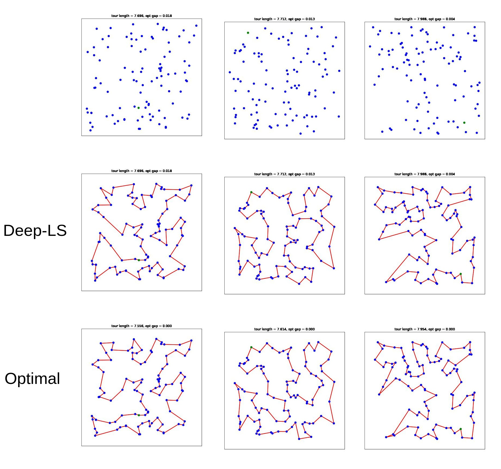
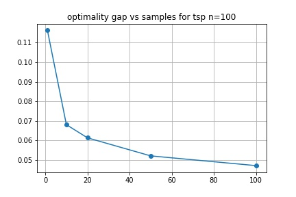

# Deep-LS

_This project is WIP, stay tuned for more updates_

The aim of the Deep-LS project is to try and utilize tools in Reinforcement Learning to perform combinatorial optimization (CO).
Specifically, it aims to combine Deep RL models and algorithms with the Local Search (LS) framework that is
well-known in the combinatorial optimization community.

Currently, this project has implemented a policy gradient method that uses a Graph Neural Network architecture
adapted from [An Efficient Graph Convolutional Network Technique
for the Travelling Salesman Problem](https://arxiv.org/pdf/1906.01227.pdf), by Joshi et al. 
The paper used the GNN in a supervised learning
end-to-end solver setting, while this project uses it in an RL setting within the Local Search Framework.

This project is also currently only focusing on the Travelling Salesman Problem as this is a relatively
straightforward problem to specify, and hence makes a reasonable starting point.

Some examples of generated solutions by the model on a 100-node TSP. Each column corresponds to a different problem
instance. The first row is the points that need to be visited, the 2nd and 3rd rows show the DeepLS solution and the
(provably) optimal solution generated by the Concorde solver, for comparison

Below is an animation of the policy GNN in action, starting from a random, highly suboptmal tour on a 50 node TSP, and 
exploring the 2-opt neighborhood of the tour at each step, for 50 steps. 

The first (left) plot shows the solution being considered by the GNN, the middle plot is the best solution constructed
so far, and the right plot shows the likelihood of selecting an edge to perturb the solution with the ultimate aim of
finding the solution with the optimal (lowest) cost function.

# Leaderboard

The following leaderboard is to track progress, based on optimality gaps evaluated on 100 instances of
TSP problems of size 20, 50 and 100 nodes respectively

These preliminary results seem to outperform several SOTA baselines in RL for combinatorial optimization 
including the Attention Model of [Kool et al](https://arxiv.org/pdf/1803.08475.pdf).

| Model / Method                                    | TSP-20 | TSP-50 | TSP-100 |
|---------------------------------------------------|--------|--------|---------|
| Average Rewards Baseline PG (greedy)              | 1.3%   | 6.0%   | 11.1%   |
| Average Rewards Baseline PG (sampling)            | 0.0%   | 0.6%   | 4.72%   |
| Average Rewards Baseline PG (greedy + postproc)   | 1.2%   | 4.0%   | 6.5%    |
| Average Rewards Baseline PG (sampling + postproc) | 0.0%   | 0.06%  | 1.5%    |

# Sample efficiency

Many deep learning-based models in CO are stochastic, meaning they construct the solution to the CO problem
by sampling actions / making a stochastic decision. Deep-LS is no exception, and one method to drastically 
improve performance is to sample multiple solutions per problem and take the best. The fewer samples needed
to achieve a better solution, the better - this is the problem of sample efficiency.

Shown below is a curve of number of samples vs optimality gap evaluated on 100 instances of a 100-node TSP:

