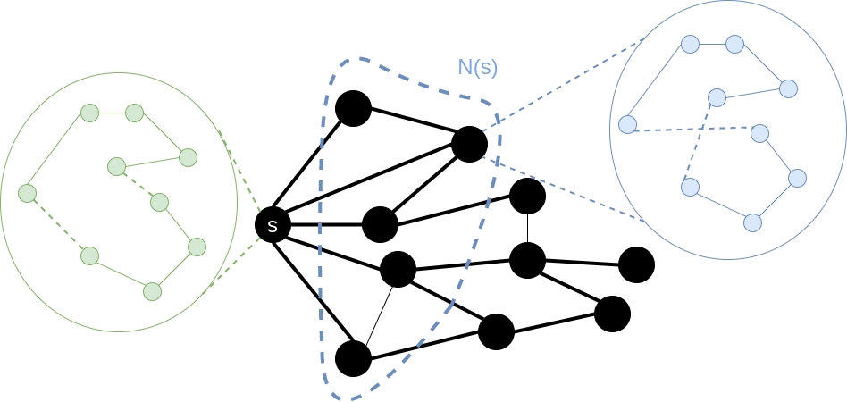
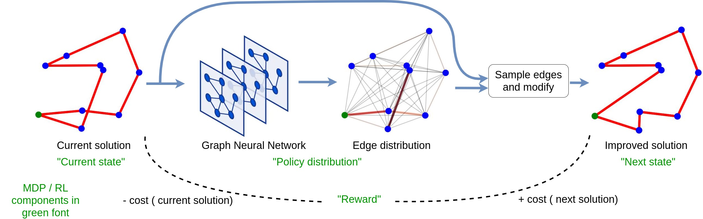

# Deep-LS

Deep-LS uses a Deep Graph Neural Network, to solve graph-based Combinatorial Optimization (CO) problems (currently just the
Travelling Salesman Problem) within the Local Search (LS) framework. The Graph Neural Network was trained using a
Policy Gradient algorithm (REINFORCE) with an Average Reward Baseline.


## Usage

To get the data for the project, run:
```commandline
chmod +x get_data.sh
get_data.sh data
```
This will download the training / test data from google drive and untar it into a folder
in `data/tsp-data`

To run the train script:
```commandline
python -m train -m model -d data/tsp-data
```
This will use the data in `data/tsp-data` and train a DeepLS policy model and save it in 
the folder `model`.

Finally, to evaluate a trained model, do:
```commandline
python -m evaluate -c <path-to-model-checkpoint>
```
Replace `<path to model checkpoint>` with the desired checkpoint produced by the train script. 

## What is Combinatorial Optimization?


- **Combinatorial Optimization (CO)**: A subfield of Mathematical Optimization that consists of finding an optimal object 
from a finite (discrete) set of objects (source: [Wikipedia](https://en.wikipedia.org/wiki/Combinatorial_optimization)).
- **Travelling Salesman Problem (TSP)**: A classic CO problem, it asks the question: _"Given a list of cities and the distances 
between each pair of cities, what is the shortest possible route that visits each city exactly once and returns 
to the origin city?"_
- **Applications**: Planning, logistics, DNA sequencing, Optimal Control
- **Difficulty**: The TSP and many similar Combinatorial Optimization problems exhibit NP-hardness, meaning that the
worst-case running time for an algorithm to solve a problem optimally scales (roughly) exponentially with the size of 
the problem.
- **Opportunity**: Many (hand-crafted) heuristics-based algorithms can solve the TSP well enough in a much shorter 
amount of time, and still achieve near-optimal performance _on average_. Can Machine Learning (specifically Reinforcement 
Learning) learn data-driven heuristics to better solve novel, unseen, problem instances?

## What is Local Search?



_Illustration of Local Search for TSP using the [2OPT neighborhood](https://en.wikipedia.org/wiki/2-opt)_ 

- A method for solving combinatorial optimization problems, by finding a solution among a number of candidate solutions
that maximizes a criterion (usually a cost function).
- Local search algorithms start from a candidate solution `s` and then iteratively moves to a neighbor solution; a 
neighborhood `N(s)` being the set of solutions that differs slightly (via small perturbations) from the current solution.
- **Question**: How can we efficiently explore the local search space of solutions, and at the same time guarantee 
the best possible outcome?
- **Answer**: Learning data-driven heuristics that can guide the exploration

## Methodology

Currently, this project has implemented a policy gradient method that uses a Graph Neural Network architecture
adapted from [An Efficient Graph Convolutional Network Technique
for the Travelling Salesman Problem](https://arxiv.org/pdf/1906.01227.pdf), by Joshi et al. 



Shown above is a schematic of the current DeepLS architecture. The Graph Neural Network takes in the current candidate 
solution (the current TSP tour), which can be represented as a graph with a number of edge and node features, and 
outputs a probability distribution over graph edges. The edges are sampled according to this probability distribution, 
which can then be used to modify the current candidate solution.

The reward (penalty) for a particular choice of edges is the decrease (increase) in cost of the
next solution generated by the policy.
Trained using a Policy Gradient algorithm (REINFORCE) the model learns to assign high probabilities to
edges that, when used to modify the current solution, will eventually minimize the cost (reward) function.

## Results and Leaderboard

Some examples of generated solutions by the model on a 100-node TSP


[//]: # (Below is an animation of the policy GNN in action, starting from a random, highly suboptmal tour on a 50 node TSP, and )

[//]: # (exploring the 2-opt neighborhood of the tour at each step, for 50 steps. )

[//]: # ()
[//]: # (The first &#40;left&#41; plot shows the solution being considered by the GNN, the middle plot is the best solution constructed)

[//]: # (so far, and the right plot shows the likelihood of selecting an edge to perturb the solution with the ultimate aim of)

[//]: # (finding the solution with the optimal &#40;lowest&#41; cost function.)

[//]: # ()
[//]: # (![]&#40;images/renders-50-nodes.gif&#41;)

These preliminary results seem to outperform several SOTA baselines in RL for combinatorial optimization 
including the Attention Model of [Kool et al](https://arxiv.org/pdf/1803.08475.pdf).

| Model / Method                                    | TSP-20 | TSP-50 | TSP-100 |
|---------------------------------------------------|--------|--------|---------|
| Average Rewards Baseline PG (greedy)              | 1.3%   | 6.0%   | 11.1%   |
| Average Rewards Baseline PG (sampling)            | 0.0%   | 0.6%   | 4.72%   |
| Average Rewards Baseline PG (greedy + postproc)   | 1.2%   | 4.0%   | 6.5%    |
| Average Rewards Baseline PG (sampling + postproc) | 0.0%   | 0.06%  | 1.5%    |


# Sample efficiency

Many deep learning-based models in CO are stochastic, meaning they construct the solution to the CO problem
by sampling actions / making a stochastic decision. Deep-LS is no exception, and one method to drastically 
improve performance is to sample multiple solutions per problem and take the best. The fewer samples needed
to achieve a better solution, the better - this is the problem of sample efficiency.

Shown below is a curve of number of samples vs optimality gap evaluated on 100 instances of a 100-node TSP:

